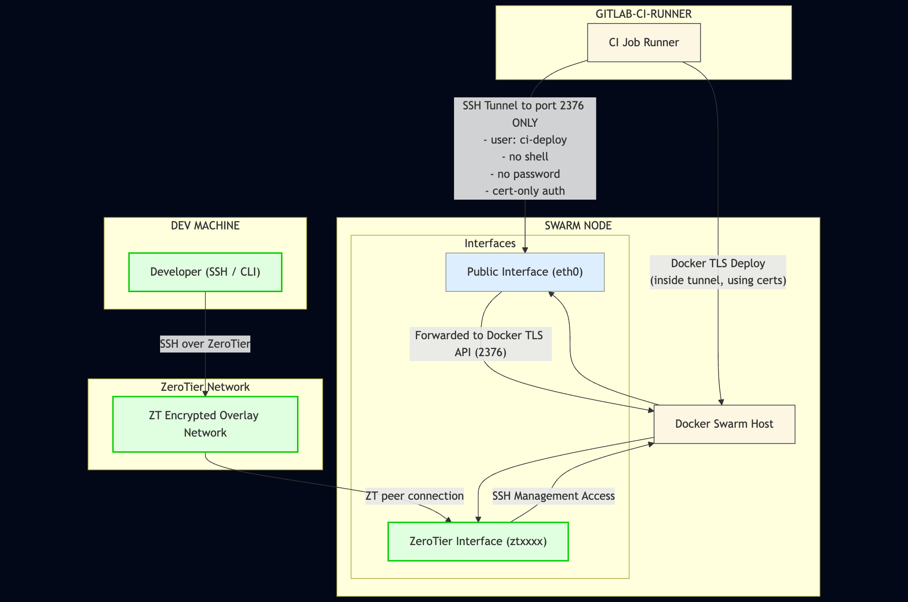

# Docker Swarm Security & CI/CD Setup Guide

A comprehensive guide for setting up a secure Docker Swarm cluster with GitLab CI/CD integration, ZeroTier private networking, and production-ready security hardening.

## 🚀 Quick Start

For experienced users who want to get started quickly:

```bash
# 1. Clone and run the setup script
git clone <repository>
cd swarm-hardening-and-setup-guide
chmod +x scripts/setup_fw.sh
chmod +x scripts/get_network_info.sh

# 2. Follow the step-by-step guide
# See docs/01-initial-setup.md
```

## 📚 Documentation Structure

- **[Initial Setup](docs/01-initial-setup.md)** - Server preparation and basic hardening
- **[Docker Swarm Setup](docs/02-docker-swarm-setup.md)** - Docker installation and Swarm initialization
- **[Security Hardening](docs/03-security-hardening.md)** - SSH, firewall, and TLS configuration
- **[ZeroTier Setup](docs/04-zerotier-setup.md)** - Private network configuration
- **[GitLab CI Setup](docs/05-gitlab-ci-setup.md)** - CI/CD pipeline configuration
- **[Traefik Deployment](docs/06-traefik-deployment.md)** - Reverse proxy and SSL setup
- **[Portainer Deployment](docs/07-portainer-deployment.md)** - Management UI (optional)
- **[Secrets Management](docs/08-secrets-management.md)** - Secure credential handling
- **[Troubleshooting](docs/09-troubleshooting.md)** - Common issues and solutions

## 🏗️ Architecture Overview



This setup provides:
- **Secure remote management** via ZeroTier VPN
- **TLS-secured Docker API** for CI/CD deployments
- **Automated SSL certificates** via Traefik and Let's Encrypt
- **GitLab CI/CD integration** for automated deployments
- **Production-ready security** with hardened SSH and firewall

## 🔧 Prerequisites

- Ubuntu 20.04+ server with public IP
- GitLab account with group access
- Domain name (for SSL certificates)
- Basic Linux administration knowledge

## 📋 What You'll Learn

- Docker Swarm cluster setup and management
- ZeroTier private network configuration
- GitLab CI/CD pipeline creation
- Traefik reverse proxy with automatic SSL
- Docker secrets management
- Security hardening best practices
- Production deployment strategies

## ⚠️ Security Disclaimer

This guide provides baseline security hardening. Adapt firewall rules, SSH policies, and security measures to your specific threat model and compliance requirements.

## 🤝 Contributing

Found an issue or have a suggestion? Please open an issue or submit a pull request.

## 📄 License

This project is licensed under the MIT License - see the LICENSE file for details.

---

**Next Steps:** Start with [Initial Setup](docs/01-initial-setup.md) to begin your secure Docker Swarm journey.


